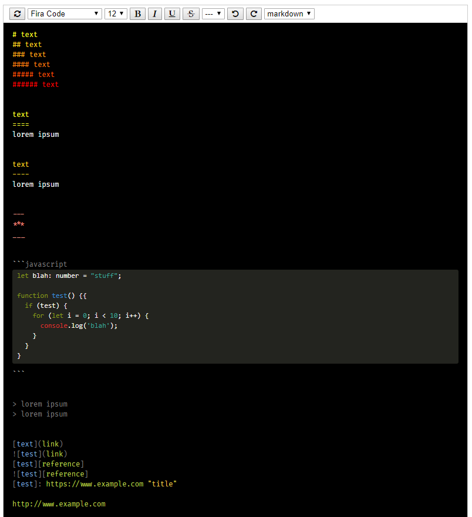

# quill-markup

> A markup highlighting module for the [Quill](https://quilljs.com/) text editor

[](https://travis-ci.org/jmquigley/quill-markup)
[](https://palantir.github.io/tslint/)
[](https://github.com/avajs/ava)
[](https://www.npmjs.com/package/quill-markup)
[](https://coveralls.io/github/jmquigley/quill-markup?branch=master)


## Requirements

- Quill v1.3.2
- Yarn 1.0.x
- Node 7.5.x+


## Installation

This module uses [yarn](https://yarnpkg.com/en/) to manage dependencies and run scripts for development.

To install as an application dependency:
```
$ yarn add --dev quill-markup
```

To build the app and run all tests:
```
$ yarn run all
```

To start a web server and view a demo of this module use:
```
$ yarn start
```
This will start a local express web server @ http://localhost:4000

If developing the module use the webpack watcher to automatically build changes with:

```
$ yarn start watch
```
This will detect changes and rebuild the bundle for testing with the web server in the previous step.  Both should be running.

See the sample application code located in `./public/app.js` and `./public/index.html`.  Using `yarn run all && yarn start` will build the application and serve it locally.


## Overview
This is a custom [Quill](https://quilljs.com/) module turns the WYSIWYG editor into a a fixed text markup editor (for modes like markdown, restructured text, etc).  It takes advantage of the underlying api for styling, undo/redo, keyboard handling, and syntax highlighting.


## Usage

#### Application Code
```javascript
import {Markup, MarkupMode} from 'quill-markup';

let keybindings = {
    tab: {
        key: 9,
        handler: function(range) {
            this.quill.insertText(range.index, '    ');
            return false;
        }
    },
    'indent code-block': null,
    'outdent code-block': null,
    'code exit': null,
    'embed left': null,
    'embed right': null,
    'embed left shift': null,
    'embed right shift': null,
    'list autofill': null
};

Quill.register('modules/markup', Markup);

let quill = new Quill('#editor', {
    clipboard: true,
    modules: {
        history: {
            delay: 2000,
            maxStack: 500,
            userOnly: true
        },
        keyboard: {
            bindings: keybindings
        },
        markup: {
            followLinks: true,
            onChange: (text) => {
                // console.log(`Changing text: ${text}`);
            },
            onClick: (pos) => {
                console.log(`clicked pos: ${pos}`);
            },
            onClickLink: (link) => {
                console.log(`clicked link: ${link.text}`);
            }
        },
        syntax: {
            delay: 100
        },
        toolbar: null
    },
    theme: 'snow'
});

let markup = quill.getModule('markup');
markup.set({
    content: 'Hello World',
    custom: {
        background: 'black',
        foreground: 'white'
    },
    mode: MarkupMode.markdown
});
```

The code above registers a new module named `Markup` with Quill.  Once it is registered, and quill is instantiated, the reference to the module can be retrieved.  We use this reference and the api below to interact with the document (outside of normal editing).  This example creates a markdown editor instance.



#### Syles

The CSS style sheets for the module and for the syntax highlighting are included with the npm package.  The files are located in `./public`.

- `./public/styles.css`
- `./public/highlights/*.css`

The module will look for these files from the root of the site serving them.


## API

#### attributes

The following attributes are used to configure the module when it is created or by using the `.set` method after creation.

- `content {string} ('')` - the initial contents of the editor.
- `custom {object} ({})` - the key/value pairs used for color stying of each highlighting type (i.e. bold, headers, italitcs, etc).
- `dirtyLimit {number} (20)` - The number of characters that are changed in the editor before a refresh is performed once the user goes idle.
- `fontName {string} ('Fira Code')` - the font that will be applied to the contents of the editor.
- `fontSize {number} (12)` - the size of the font in pixels
- `followLinks {boolean} (false)` - if a mode parses links (urls, wiki, etc) such as markdown then this will enable the `onClickLink` callback.  This callback is invoked when a user clicks on a link within the editor.  e.g. in markdown a link is `[name](link)`.  If this is clicked, then the callback is executed and passed the full parsing of the link.  This editor will not open the links by default, but will give the developer the option on how to handle the clicked link.
- `highlight {string} ('solarized-light')` - the name of the syntax highlight scheme from highlight.js
- `idleDelay {number} (2000)` - the number of milliseconds the UI will wait for user input before signalling that the UI is idle.
- `mode {MarkupMode} (MarkupMode.text)` - the document highlighting mode.  This is where a user would select markdown, asciidoc, rst, etc.
- `onChange` - event handler invoked when the contents of the editor change (see below)
- `onClick` - event handler invoked when the user clicks within the editor (see below)
- `onClickLink` - event handler invoked when the user clicks a link within the editor (see below)

#### methods

Once the module is created in Quill the instance can be retrieved.  This instance is then used to interact with the contents of the editor.  The example code above shows how to use `getModule` to retrieve this instance.

- `.editor` - a property reference to the editor DOM node.
- `.editorKey` - the string name of the id selector where this editor instance resides in the DOM.
- `.fonts` - an array of strings of all fonts that can be used by this editor.  The module will attempt to detect all available fonts from the browser environment.
- `.highlights` - an array of all fenced code region highlight color schemes.  One of these values can be sent to the `setHighlight()` call to change the current highlight mode.
- `.modes` - an array of strings of all modes available to the editor.
- `.opts` - the options that were used when the module was created or changed by `.set`.  This is an object that contains all of the attributes listed above.
- `.quill` - a reference to this mode's quill instance (not the global Quill)
- `.redo()` - a wrapper for the quill redo function.
- `.refresh()` - runs the highlighting scanner for the current mode on the full document.
- `.set({MarkupOptions})` - used to change any of the initial startup options.  The attributes list above gives the names of all options within `MarkupOptions`.
- `.setBold()` - calls the current syntax processor mode's bold function and applies the bold formatting to either the selection area or the word at the current cursor.
- `.setContent(content: string)` - changes the full content of the editor.
- `.setFont(name: string)` - changes the current font by name.
- `.setFontSize(size: number)` - changes the current font size by pixels (so 12 would be '12px')
- `.setHeader(level: string)` - sets the sizing on the current content location position to one of six header sizes (1 - 6).  e.g. `setHeader('1')` will set the current location to an `h1` header.
- `.setHighlight(name: string)` - changes the [syntax highlighting color scheme](https://github.com/isagalaev/highlight.js/tree/master/src/styles).  Quill uses [highlight.js](https://highlightjs.org/) for code highlighting.
- `.setItalic()` - calls the current syntax processor mode's italic function and applies the italic formatting to either the selection area or the word at the current cursor.
- `.setMode(mode: string)` - the name of the highlighting mode to use.  The use case for this is a drop down list that contains the names of all modes that may be passed to this call (which is why it's a string instead of the `MarkupMode.{val}`)
- `.setStrikeThrough()` - calls the current syntax processor mode's strikethrough function and applies the strikethrough formatting to either the selection area or the word at the current cursor.
- `.setUnderline()` - calls the current syntax processor mode's underline function and applies the underline formatting to either the selection area or the word at the current cursor.
- `.undo()` - a wrapper for the quill undo function.

#### events

The mode exposes three events as part of the configuration:

- `onChange(text: string)` - Changes that are made to the editor are given as a parameter to this callback.  It is rate limited and will only call this handler every 250ms.
- `onClick(pos: number)` - When the editor is clicked this callback is invoked.  It is passed the location within the buffer where the click occurred.
- `onClickLink(link: string)` - A mode that contains links will invoke this callback when one of the links are clicked.  It is passed the string of the link that was pressed.


## Highlight Customization

The module attributes above contain a key named `.custom`.  This is an object that contains color settings used to override the defaults.  Each value is either a hex or named color.  The default values can be found in [highlight.json](https://github.com/jmquigley/quill-markup/blob/master/lib/highlighting.json).  The idea is that most editing modes contain many of the same highlights (with differing syntax).  This is an attempt to create a base set of highlights that would be applied to any mode.  It contains the following options:

- `admonition` - special strings like TODO or FIXME.  This is the foreground color
- `admonitionBackground` - background color for special strings like TODO and FIXME
- `background (white)` - the editor background color
- `blockquote`
- `bold`
- `chevron` - the paren, brace, brackets around an item (such as a link)
- `fence` - The color of the fenced code region
- `foreground (black)` - the editor foreground color
- `forumula` - LaTeX formula regions or inlines
- `h1` - header level 1
- `h2` - header level 2
- `h3` - header level 3
- `h4` - header level 4
- `h5` - header level 5
- `h6` - header level 6
- `hr` - horizontal line markup
- `italic`
- `language` - the name of the language for a fenced code region.  Today this is just decoration due to limits in Quill (it only uses code to try discover the language implicitly instead of explicit declaration)
- `link` - URI links
- `linkName` - The color associated with the name ([name](link)) in a link
- `linkTitle` - optional title values on links
- `list` - number and bullet list chevrons
- `mono`
- `strikethrough`
- `underline`
- `wiki` - wiki name coloring in [[name | link]]


## Testing

Note that some of the testing is limited due to use of JSDOM.  This library, and Quill, rely on `getSelection` to determine positions within the editor.  This function is not available in JSDOM and is a helper stub in this module (see `./test/helpers/getSelection.js`).  Right now I don't see a way to move around within the an instantiated editor within this DOM (to test things like inserting new characters randomly and testing undo/redo).  If any ever uses this and has suggestions on how to overcome this it would be most welcome.
